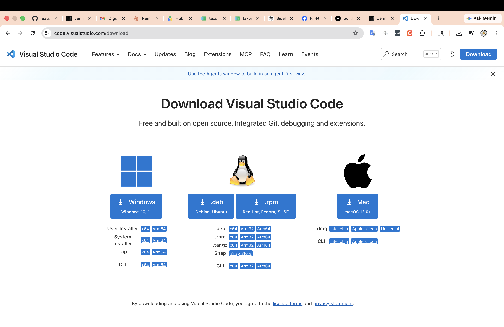
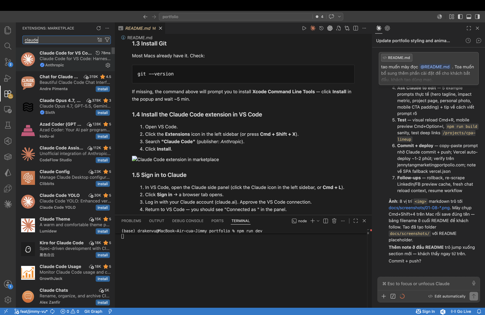
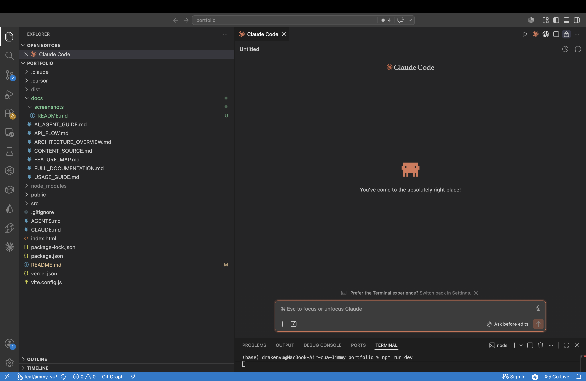
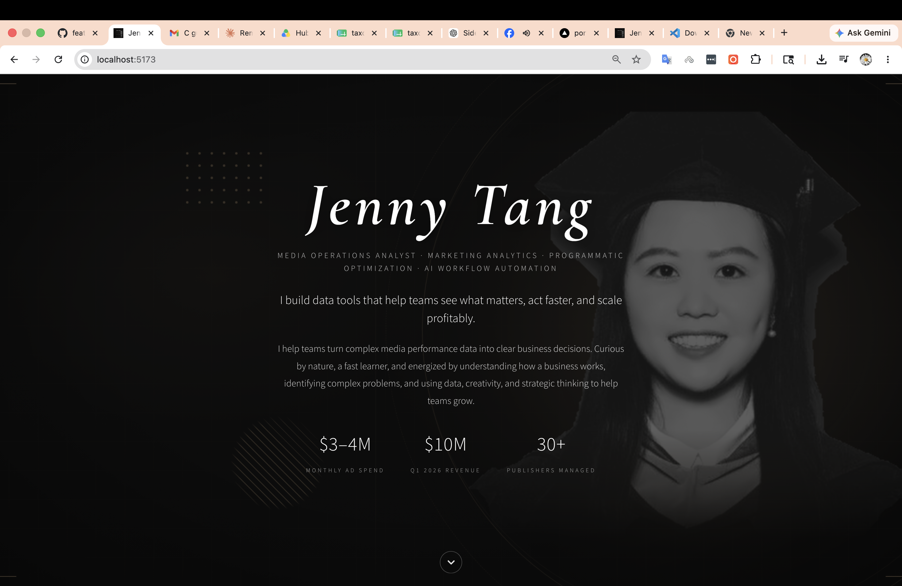
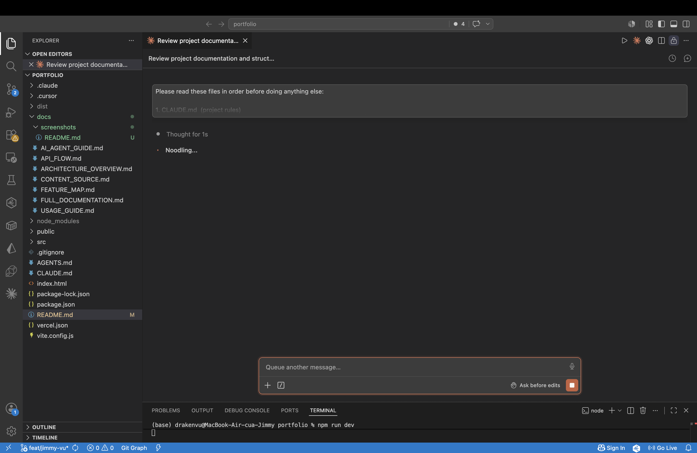
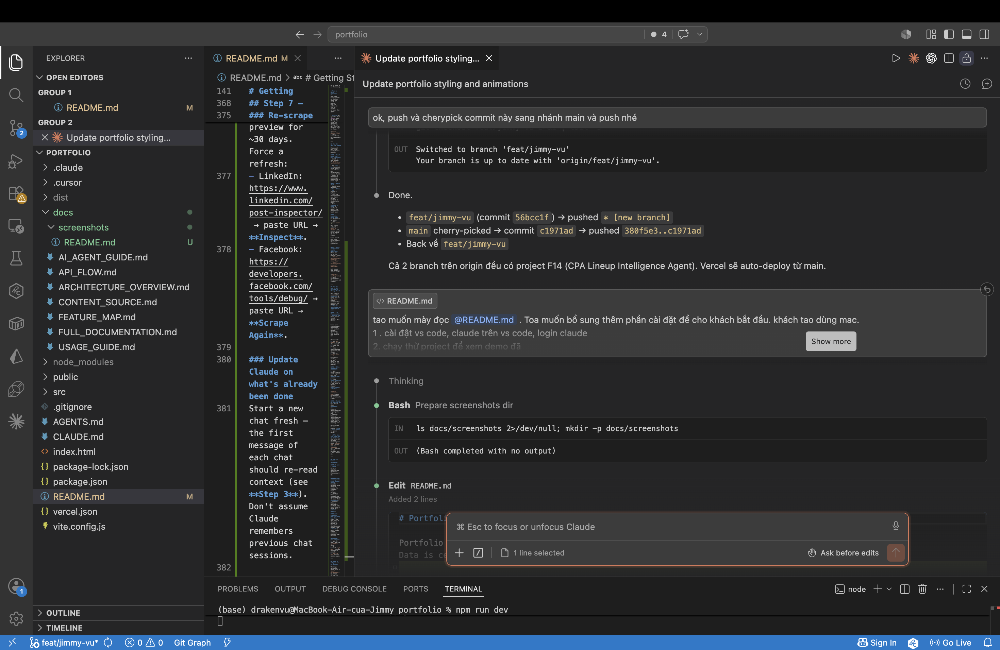
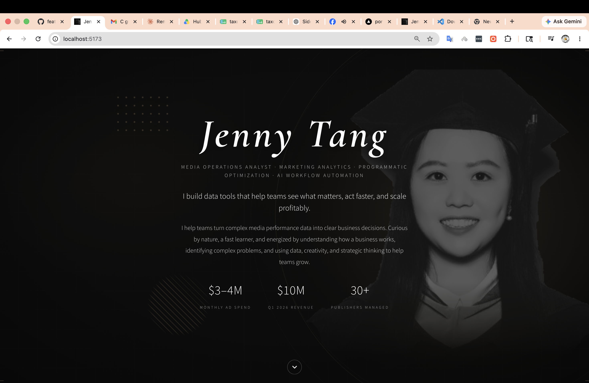
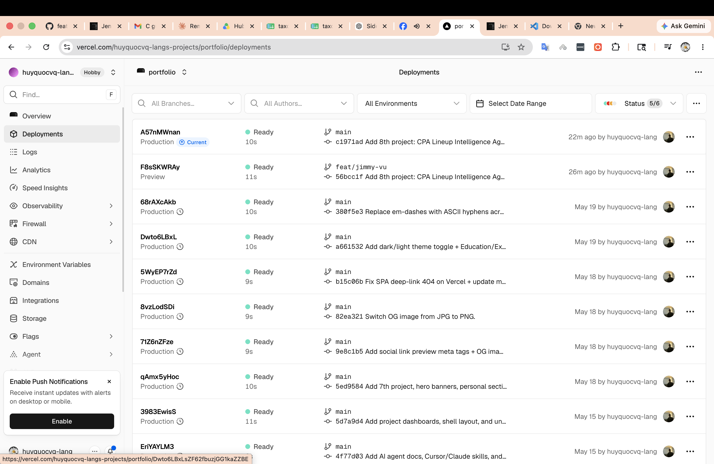

# Portfolio — React JS

Portfolio React project built from the original HTML template.
Data is centralized in `src/data/` for easy editing.

> **New here?** Jump to **[Getting Started (Mac, step-by-step)](#getting-started-mac-step-by-step)** below for a complete walkthrough — install tools, run locally, ask Claude Code to make changes, test, and deploy through Vercel.

## Content source

Long-form copy for mapping lives in **[docs/CONTENT_SOURCE.md](./docs/CONTENT_SOURCE.md)** (not bundled in the app).  
Runtime text is in `src/data/*` and `src/projects/*`. User instructions override the content source file.

## AI / Cursor / Claude

| File | Purpose |
|------|---------|
| [AGENTS.md](./AGENTS.md) | Entry point for AI agents |
| [docs/USAGE_GUIDE.md](./docs/USAGE_GUIDE.md) | Usage guide + doc sync table |
| [docs/AI_AGENT_GUIDE.md](./docs/AI_AGENT_GUIDE.md) | Agent workflows (EN) |
| `.cursor/rules/sync-documentation.mdc` | Rule: every code change must update docs |
| `.cursor/skills/portfolio-site/SKILL.md` | Cursor skill → invoke or auto-load |
| `.claude/skills/portfolio-site/SKILL.md` | Claude Code skill → `/portfolio-site` |
| `.claude/skills/sync-documentation/SKILL.md` | Claude Code skill → `/sync-documentation` |
| [CLAUDE.md](./CLAUDE.md) | Claude Code project instructions |

**Rule:** any code change → update the matching docs in the same commit.

## Setup

```bash
npm install
npm run dev
```

Open http://localhost:5173

## Build for production

```bash
npm run build
# Output: dist/
```

## Folder structure

```
portfolio/
├── public/
│   └── images/                 ← Place all images here
│       ├── hero-bg.jpg         ← Hero background
│       └── projects/           ← Project thumbnails
│           ├── winterplace.jpg
│           ├── programmatic.jpg
│           ├── trend-analysis.jpg
│           ├── pf-master.jpg
│           ├── glean-planner.jpg
│           └── ai-rewriter.jpg
├── src/
│   ├── data/                   ← ALL CONTENT LIVES HERE
│   │   ├── profile.js          ← Name, role, tagline, contact
│   │   ├── stats.js            ← Hero stats + Impact highlights
│   │   ├── about.js            ← About section text
│   │   ├── skills.js           ← Skills grid
│   │   └── projects.js         ← Featured + Other projects
│   ├── components/             ← UI components (reusable)
│   │   ├── Hero.jsx
│   │   ├── Nav.jsx
│   │   ├── Impact.jsx
│   │   ├── AboutSkills.jsx
│   │   ├── Skill.jsx           ← Reusable skill card
│   │   ├── Projects.jsx
│   │   ├── FeaturedProject.jsx
│   │   ├── OtherProject.jsx    ← Reusable project card
│   │   └── Footer.jsx
│   ├── styles/
│   │   └── global.css          ← All styles in one file
│   ├── App.jsx
│   └── main.jsx
├── index.html
├── package.json
└── vite.config.js
```

## How to edit content

All editable content lives in `src/data/`. You don't need to touch components.

### Change name, tagline, contact
Edit `src/data/profile.js`

### Change hero stats or impact numbers
Edit `src/data/stats.js`

### Change About text
Edit `src/data/about.js` — `paragraphs` is an array, add/remove freely.

### Change skills
Edit `src/data/skills.js` — array of skill objects.

### Add / edit / reorder projects
Edit `src/data/projects.js`:
- `featuredProject` — the pinned project at the top
- `otherProjects` — array; add/remove/reorder items

To swap which project is featured: move the object between `featuredProject` 
and `otherProjects`.

## How to add images

1. Put your image file in `public/images/` (or `public/images/projects/`)
2. Reference it in the data file as `/images/your-file.jpg` 
   (path starts with `/`, no `public` prefix — Vite serves `public/` at root)

Example:
```js
image: '/images/projects/winterplace.jpg'
```

## Replacing the placeholder images

The data files reference image paths that don't exist yet. Add real images at:

- `public/images/hero-bg.jpg`           (hero background)
- `public/images/projects/winterplace.jpg`
- `public/images/projects/programmatic.jpg`
- `public/images/projects/trend-analysis.jpg`
- `public/images/projects/pf-master.jpg`
- `public/images/projects/glean-planner.jpg`
- `public/images/projects/ai-rewriter.jpg`

Recommended sizes:
- Hero: 2000×1200 (will be cropped to viewport)
- Featured project: 1400×900 (16:10 aspect)
- Other projects: 1200×750 (16:10 aspect)

Per the original brief, avoid uploading internal dashboards or confidential 
data — use mockups or anonymized visuals.

---

# Getting Started (Mac, step-by-step)

A complete walkthrough from "fresh laptop" → "live site updated by Claude". Tested on macOS. Screenshots referenced as `docs/screenshots/*.png` — drop your own captures there as you go.

## Step 1 — Install the tools

You need four things: **VS Code**, **Claude Code extension**, **Git**, and **Node.js 18+**.

### 1.1 Install VS Code
1. Open https://code.visualstudio.com/ in Safari/Chrome.
2. Click **Download Mac Universal** (works on both Intel and Apple Silicon).
3. Open the downloaded `.zip` → drag **Visual Studio Code.app** into **Applications**.
4. Launch VS Code from Applications (right-click → Open the first time to bypass Gatekeeper).



### 1.2 Install Node.js (18 or newer)
Open **Terminal** (Cmd + Space → "Terminal") and check if Node is already installed:
```bash
node -v
```
If you see `v18.x.x` or higher → skip ahead. If you get "command not found" or an older version:

1. Download the LTS installer from https://nodejs.org/
2. Run the `.pkg` → follow the prompts (default options are fine).
3. Reopen Terminal and verify:
```bash
node -v   # should print v20.x.x or similar
npm -v
```

### 1.3 Install Git
Most Macs already have it. Check:
```bash
git --version
```
If missing, the command above will prompt you to install **Xcode Command Line Tools** — click **Install** in the popup and wait ~5 min.

### 1.4 Install the Claude Code extension in VS Code
1. Open VS Code.
2. Click the **Extensions** icon in the left sidebar (or press **Cmd + Shift + X**).
3. Search **"Claude Code"** (publisher: *Anthropic*).
4. Click **Install**.



### 1.5 Sign in to Claude
1. In VS Code, open the Claude side panel (click the Claude icon in the left sidebar, or **Cmd + L**).
2. Click **Sign in** → a browser tab opens.
3. Log in with your Claude account (claude.ai). Approve the VS Code connection.
4. Return to VS Code — you should see "Connected as <your email>" in the panel.



---

## Step 2 — Run the project locally (see the demo)

1. **Get the code.** In Terminal:
```bash
cd ~/Documents                              # or wherever you keep projects
git clone git@github.com:huyquocvq-lang/portfolio.git
cd portfolio
```
> If you don't have SSH set up, use HTTPS:
> `git clone https://github.com/huyquocvq-lang/portfolio.git`

2. **Open the folder in VS Code.** From Terminal:
```bash
code .
```
*(If `code` is not found: in VS Code, **Cmd + Shift + P** → "Shell Command: Install 'code' command in PATH".)*

3. **Install dependencies + start dev server.** In VS Code, open the integrated terminal (**Ctrl + `**) and run:
```bash
npm install     # one-time, ~30 seconds
npm run dev
```

4. **Open the site.** Cmd-click the URL printed in the terminal (usually `http://localhost:5173`) — it opens in your browser.



Leave the dev server running while you edit — any change auto-refreshes the browser.

---

## Step 3 — Let Claude read the project context

Open the Claude panel (**Cmd + L**) and paste this as your **first message** in a new chat:

```
Please read these files in order before doing anything else:

1. CLAUDE.md  (project rules)
2. AGENTS.md  (entry point for AI agents)
3. docs/USAGE_GUIDE.md  (workflow + doc sync table)
4. docs/FEATURE_MAP.md  (feature → file map for all sections + projects)
5. docs/CONTENT_SOURCE.md  (the source-of-truth copy reference)

Then summarize: what kind of project is this, where does the homepage
content live, where do project case studies live, and what's the rule
about updating documentation when I change code?
```

Claude will read the files and reply with a summary. Once you see that summary, Claude has the full context — every subsequent prompt builds on it.



---

## Step 4 — Ask Claude to make a change

The key idea: **describe what you want in plain English (or Vietnamese)** — Claude finds the right files and edits them. You don't need to know which file holds what.

### Example prompts

**Edit text (name, tagline, role, etc.)**
```
Change my hero tagline to: "Turning messy media data into revenue-driving decisions."
```

**Add or update an Impact metric**
```
Add a new impact highlight: "$2M projected revenue lift in Q2 2026 from
reallocating budget toward LinkedIn." Place it as the second card.
```

**Update a project page**
```
On /projects/winterplace, change the "Recommendation" callout to
"$250K budget shift to LinkedIn" (was $200K). Update CONTENT_SOURCE.md
to match.
```

**Add a new section, project, or photo**
```
Add a new personal-interest photo: I'll save the file at
public/images/personal/personal_7.jpeg. Update src/data/personal.js
so it shows up in the masonry.
```

**Tweak a color / spacing**
```
The "View Projects" CTA on the hero looks too small on mobile.
Bump the padding by ~30% on screens narrower than 768px.
```

> **Tip:** Be specific about *which* page or section. "Change the title" is ambiguous; "Change the hero title on the home page" is clear.



---

## Step 5 — Test the change

Claude will edit files. Verify before pushing:

### 5.1 Visual check (the most important)
- Switch to your browser at `http://localhost:5173`.
- Hit **Cmd + R** to refresh (Vite usually auto-reloads, but force-refresh removes doubt).
- Scroll to the section you changed and confirm it looks right.

### 5.2 Mobile check
- Open browser DevTools: **Cmd + Option + I** (Chrome / Safari).
- Click the device toolbar icon (📱) — Chrome: top-left of the DevTools panel.
- Pick **iPhone 14 Pro** or similar — confirm the change still looks good.

### 5.3 Production build check
In the VS Code terminal:
```bash
npm run build
```
This should end with `✓ built in <time>s`. If you see a red error, paste it back to Claude:
```
Build failed with this error: <paste the error>. Please fix.
```

### 5.4 Quick sanity check (route deep-links)
While dev server is running, visit:
- `http://localhost:5173/projects/winterplace`
- `http://localhost:5173/projects/cpa-lineup`

Both should load directly without a 404.



---

## Step 6 — Push to Git + auto-deploy through Vercel

This repo is connected to **Vercel** — every push to the `main` branch automatically rebuilds and deploys to **https://jennytangmarketingportpolio.com**.

### 6.1 Let Claude commit + push for you
After you've tested locally, tell Claude:

```
Looks good. Please commit the changes with a short message describing
what we did, then push to main.
```

Claude will:
1. Run `git status` to see what changed.
2. Stage the files.
3. Write a commit message describing the change.
4. Push to `origin main`.

Within ~1–2 minutes, Vercel rebuilds and the live site updates.

### 6.2 Watch the deploy (optional)
1. Open https://vercel.com → log in → pick the **portfolio** project.
2. Click **Deployments** → you'll see a new build at the top, status **Building** → **Ready**.



### 6.3 Verify on the live URL
Once Vercel shows **Ready**:
```
https://jennytangmarketingportpolio.com           # homepage
https://jennytangmarketingportpolio.com/projects/cpa-lineup   # any deep link
```
Hard-refresh in your browser (**Cmd + Shift + R**) to bypass cache.

> **If a deep link shows 404 on Vercel:** that's the SPA fallback misconfigured. Check `vercel.json` exists with the `rewrites` rule. The repo already includes this — don't delete it.

---

## Step 7 — Common follow-ups

### Roll back a change
```
The last commit broke the layout. Please revert it.
```

### Re-scrape social preview after content change
LinkedIn / Facebook cache the link preview for ~30 days. Force a refresh:
- LinkedIn: https://www.linkedin.com/post-inspector/ → paste URL → **Inspect**.
- Facebook: https://developers.facebook.com/tools/debug/ → paste URL → **Scrape Again**.

### Update Claude on what's already been done
Start a new chat fresh — the first message of each chat should re-read context (see **Step 3**). Don't assume Claude remembers previous chat sessions.

### Resume work tomorrow
1. Open VS Code, open the `portfolio` folder.
2. In Terminal: `git pull` (in case anyone else pushed).
3. `npm run dev` → start editing again.

---