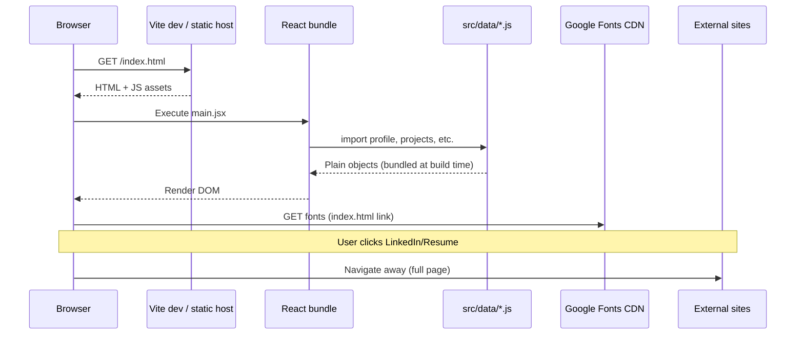

# API & External Data Flow — Jenny Tang Portfolio

> This project has **no first-party REST/GraphQL API** and **no authentication layer**. It is a static content site. This document describes actual external data flows and what to do if you add a backend later.

## Current architecture: static content



## HTTP client

**Not present.** No `axios`, `fetch` wrappers, or `react-query` in `package.json`.

## “Endpoints” (external only)

| URL | Method | Used by | Purpose |
|-----|--------|---------|---------|
| N/A (bundled modules) | — | All components | Content from `src/data` and project JSX |
| `https://fonts.googleapis.com/...` | GET | `index.html` | Source Sans Pro + Cormorant Garamond |
| `profile.contact.linkedin` | GET (browser navigation) | `Nav.jsx` | User profile |
| `profile.contact.resume` | GET (browser navigation) | `Nav.jsx` | Google Docs resume |
| `/images/*` | GET | Hero, project heroes | Static assets from `public/images/` |

### Image asset paths (static files)

| Path | Referenced in |
|------|----------------|
| `/images/hero-bg.jpg` | `profile.heroImage` |
| `/images/projects/winterplace.jpg` | `featuredProject.image` |
| `/images/projects/programmatic.jpg` | `otherProjects[0]` |
| `/images/projects/trend-analysis.jpg` | `otherProjects[1]` |
| `/images/projects/pf-master.jpg` | `otherProjects[2]` |
| `/images/projects/glean-planner.jpg` | `otherProjects[3]` |
| `/images/projects/ai-rewriter.jpg` | `otherProjects[4]` |

See `public/images/README.txt` for placement notes.

## Authentication flow

**Not applicable.** No login, tokens, sessions, or secure storage.

## Error handling (network)

No API error boundaries. Possible runtime issues:

| Scenario | Behavior |
|----------|----------|
| Missing image file | Broken background image (browser 404) |
| Invalid project slug | `ProjectPage` pattern removed; unknown routes fall through unless host returns SPA index |
| Missing route in `App.jsx` | Blank or host 404 depending on deployment |

To add a catch-all route, extend `App.jsx`:

```jsx
<Route path="*" element={<Navigate to="/" replace />} />
```

(Currently only defined routes exist; direct URL to unknown path depends on host SPA config.)

## Routing vs “API”

`react-router-dom` handles client-side navigation only:

```javascript
// src/App.jsx — explicit route table
<Route path="/projects/winterplace" element={<WinterplaceProject />} />
```

No route loaders, no data fetching on navigation.

## Hash-based deep linking (home)

```javascript
// src/pages/HomePage.jsx
useEffect(() => {
  if (!window.location.hash) return
  const id = window.location.hash.replace('#', '')
  document.getElementById(id)?.scrollIntoView({ behavior: 'smooth' })
}, [])
```

Flow: User opens `https://site.com/#work` → Home mounts → scrolls to `#work`.

## If you add a real API later (recommended pattern)

This repo does not implement the following; use as migration guide:

```
src/
  api/
    client.js          # fetch wrapper, base URL from import.meta.env
    endpoints.js       # path constants
  services/
    portfolioService.js
  hooks/
    useProjects.js     # optional react-query
```

### Suggested env vars (Vite)

```bash
# .env.local (not committed)
VITE_API_BASE_URL=https://api.example.com
```

Access via `import.meta.env.VITE_API_BASE_URL`.

### Token handling (if auth added)

Not in scope today. Would typically use:
- HttpOnly cookies (preferred for web), or
- Bearer token in memory + refresh flow

Do not store secrets in `src/data/*` — those files are public in the bundle.

## Third-party services summary

| Service | Data sent | Privacy note |
|---------|-----------|--------------|
| Google Fonts | IP, referrer | CDN request from visitor browser |
| LinkedIn / Google Docs | Standard referrer when user clicks | Leaves site |

## CMS / headless content (future)

To avoid redeploying for copy changes, consider:
- Contentful / Sanity / markdown in repo
- Build-time fetch in `vite.config.js`

Current design optimizes for **simplicity and full design control per project page**.
