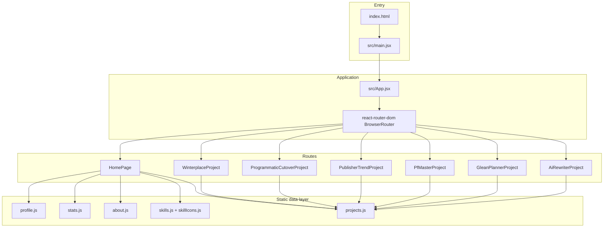

# Architecture Overview — Jenny Tang Portfolio

> **Stack reality check:** This repository is a **React 18 single-page application (SPA)** built with **Vite 5**, deployed as static web assets. It is **not** a React Native mobile app. There is no `ios/`, `android/`, Metro bundler, or native bridge code.

## High-level diagram



## Architectural pattern

| Pattern | How it applies in this project |
|---------|--------------------------------|
| **Component-based UI** | React function components only; no class components |
| **Data-driven content** | All copy, stats, projects live in `src/data/*.js` — UI reads imports |
| **Page-per-route** | `HomePage` + 6 dedicated project page components |
| **Per-feature styling** | Global CSS + per-project CSS files (not CSS-in-JS) |
| **Thin shell wrapper** | `ProjectShell` provides Nav, back link, prev/next pager, Footer |

**Not used:** Redux, Zustand, Context API for global state, React Query, backend API layer, React Native Navigation.

## Data flow

1. **Build time:** Vite bundles JSX + CSS; `public/` assets copied as-is to `dist/`.
2. **Runtime:** No fetch to owned backend. Content is JavaScript module exports.
3. **Home:** Components import from `src/data/*` and render sections vertically.
4. **Project pages:** Each `src/projects/*Project.jsx` owns layout + copy; metadata card fields come from `getProjectCard(slug)` in `projects.js`.
5. **Images:** Paths like `/images/hero-bg.jpg` resolve from `public/images/`.

## Routing architecture

Defined explicitly in `src/App.jsx` (not file-based routing):

| Path | Component |
|------|-----------|
| `/` | `HomePage` |
| `/projects/winterplace` | `WinterplaceProject` |
| `/projects/programmatic-cutover` | `ProgrammaticCutoverProject` |
| `/projects/publisher-trend-analysis` | `PublisherTrendProject` |
| `/projects/pf-master` | `PfMasterProject` |
| `/projects/glean-planner` | `GleanPlannerProject` |
| `/projects/ai-rewriter` | `AiRewriterProject` |

`vite.config.js` sets `appType: 'spa'` so deep links work on static hosts that rewrite to `index.html`.

## State management

| State type | Location | Scope |
|------------|----------|-------|
| Hero entrance animation | `Hero.jsx` — `ready` | Local |
| Hero scroll crossfade | `Hero.jsx` — `scrollProgress` | Local + window scroll listener |
| Mobile nav drawer | `Nav.jsx` — `open` | Local |
| Everything else | Props from imported data | Stateless presentation |

No global store. No persistence layer.

## Styling architecture

```
src/styles/global.css       → site-wide tokens, homepage sections, responsive
src/styles/project-shell.css → shared project page chrome (back, pager)
src/styles/projects/*.css     → one file per project page (unique layouts)
```

CSS variables in `:root`:

- `--text-base`, `--font-body`, `--font-display` (Cormorant Garamond for author name)

## External integrations (not owned API)

| Integration | Type | Source |
|-------------|------|--------|
| Google Fonts | CDN link in `index.html` | Typography |
| LinkedIn / Resume | External URLs in `profile.contact` | Nav links |
| Project case studies | In-page static content | Per-project JSX files |

## Deployment model

Static `dist/` after `npm run build`. Suitable for GitHub Pages, Netlify, Vercel, S3+CloudFront. No server-side rendering.

## Key dependency graph

```
main.jsx
  └── App.jsx (react-router-dom)
        ├── HomePage
        │     ├── Hero → profile, stats
        │     ├── Nav → profile
        │     ├── Impact → stats
        │     ├── AboutSkills → about, skills, Skill
        │     ├── Projects → FeaturedProject, OtherProject → projects
        │     └── Footer → profile
        └── *Project.jsx
              └── ProjectShell → Nav, Footer, projects (pager)
                    └── project-specific markup + project CSS
```

## Extension points (safe)

- **Content edits:** `src/data/*`
- **New homepage section:** new component + import in `HomePage.jsx` + CSS in `global.css`
- **New project:** new `src/projects/X.jsx` + CSS + route in `App.jsx` + entry in `projects.js`

## Core constraints (do not break)

- `getAllProjects()` order defines prev/next pager sequence
- `slug` in `projects.js` must match route path and `ProjectShell slug` prop
- Hero scroll math assumes `#impact` exists below hero on home page
