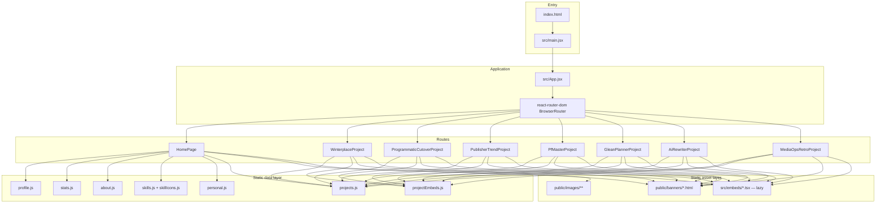

# Architecture Overview — Jenny Tang Portfolio

> **Stack reality check:** This repository is a **React 18 single-page application (SPA)** built with **Vite 5**, deployed as static web assets. It is **not** a React Native mobile app. There is no `ios/`, `android/`, Metro bundler, or native bridge code.

## High-level diagram



## Architectural pattern

| Pattern | How it applies in this project |
|---------|--------------------------------|
| **Component-based UI** | React function components only; no class components |
| **Data-driven content** | All copy, stats, projects live in `src/data/*.js` — UI reads imports |
| **Page-per-route** | `HomePage` + 7 dedicated project page components |
| **Per-feature styling** | Global CSS + per-project CSS files (not CSS-in-JS); theme tokens on `:root` of `global.css` |
| **Thin shell wrapper** | `ProjectShell` provides Nav, hero banner (iframe or image), breadcrumbs, children, prev/next pager, Footer |
| **Lazy embed slots** | Dashboards live in `src/embeds/*.tsx` and are `React.lazy`-loaded by `EmbedSlot` per project page |
| **Self-contained banners** | Each project banner is a standalone HTML in `public/banners/` rendered via sandboxed `<iframe>` (`BannerEmbed`) on both home cards and detail heroes |
| **Single React Context** | `ThemeContext` (`src/context/ThemeContext.jsx`) for dark/light theme — only global state in the app. Persists to `localStorage` (`portfolio-theme`); first-visit defaults to OS `prefers-color-scheme`. Anti-FOUC inline script in `index.html` sets `data-theme` before bundle loads. |

**Not used:** Redux, Zustand, React Query, backend API layer, React Native Navigation. (Context API limited to theme switching only — see `ThemeContext.jsx`.)

## Data flow

1. **Build time:** Vite bundles JSX + CSS; `public/` assets copied as-is to `dist/`.
2. **Runtime:** No fetch to owned backend. Content is JavaScript module exports.
3. **Home:** Components import from `src/data/*` and render sections vertically.
4. **Project pages:** Each `src/projects/*Project.jsx` owns layout + copy; metadata card fields come from `getProjectCard(slug)` in `projects.js`.
5. **Images:** Paths like `/images/hero-bg.jpg` resolve from `public/images/`.

## Routing architecture

Defined explicitly in `src/App.jsx` (not file-based routing):

| Path | Component |
|------|-----------|
| `/` | `HomePage` |
| `/projects/winterplace` | `WinterplaceProject` |
| `/projects/programmatic-cutover` | `ProgrammaticCutoverProject` |
| `/projects/publisher-trend-analysis` | `PublisherTrendProject` |
| `/projects/pf-master` | `PfMasterProject` |
| `/projects/glean-planner` | `GleanPlannerProject` |
| `/projects/ai-rewriter` | `AiRewriterProject` |
| `/projects/media-ops-retro` | `MediaOpsRetroProject` |

`vite.config.js` sets `appType: 'spa'` so deep links work on static hosts that rewrite to `index.html`.

## State management

| State type | Location | Scope |
|------------|----------|-------|
| Hero entrance animation | `Hero.jsx` — `ready` | Local |
| Hero scroll crossfade | `Hero.jsx` — `scrollProgress` | Local + window scroll listener |
| Mobile nav drawer | `Nav.jsx` — `open` | Local + body overflow lock |
| Theme (dark/light) | `src/context/ThemeContext.jsx` — `theme` | Global via React Context; mirrored to `html[data-theme]` + `localStorage` |
| Dashboard fullscreen toggle | `EmbedSlot.jsx` — `fullscreen` | Local + body overflow lock + Esc handler |
| AI rewriter lightbox | `AiRewriterProject.jsx` — `zoomed` | Local + body overflow lock + Esc handler |
| Banner scaling | inline `<script>` inside each `public/banners/*.html` | Per-iframe document |
| Everything else | Props from imported data | Stateless presentation |

Theme is the only piece of global state and the only piece persisted (to `localStorage`, key `portfolio-theme`).

## Styling architecture

```
src/styles/global.css        → :root theme tokens, homepage sections, responsive
src/styles/project-shell.css → shared project page chrome (hero, breadcrumbs, pager)
src/styles/project-intro.css → shared project intro block
src/styles/embed-slot.css    → dashboard slot (canvas + fullscreen layer)
src/styles/projects/*.css    → one file per project page (unique layouts)
```

CSS variables in `:root` (`global.css`):

- Typography: `--text-base`, `--font-body`, `--font-display` (Cormorant Garamond for author name)
- Theme (charcoal + bronze gold by default; light overrides on `:root[data-theme="light"]`):
  - Surfaces: `--bg-primary`, `--bg-elevated`, `--bg-elevated-2`
  - Accent: `--accent`, `--accent-hover` (accent stays bronze in both themes)
  - Text: `--text-heading`, `--text-body`, `--text-muted`, `--text-on-accent`
  - Borders: `--border-subtle`, `--border-accent`
  - Always-dark surfaces (hero overlay copy, lightbox): `--text-on-dark`, `--text-on-dark-soft`, `--text-on-dark-muted`, `--text-on-dark-faint`, `--border-on-dark`

The active theme is selected by `:root[data-theme]` (set by `ThemeContext` at runtime + an anti-FOUC inline script in `index.html`). All non-hero / non-dashboard surfaces reference these tokens via `var(...)` — never hardcode the swatch.

## External integrations (not owned API)

| Integration | Type | Source |
|-------------|------|--------|
| Google Fonts | CDN link in `index.html` | Typography |
| LinkedIn / Resume | External URLs in `profile.contact` | Nav links |
| Project case studies | In-page static content | Per-project JSX files |

## Deployment model

Static `dist/` after `npm run build`. Suitable for GitHub Pages, Netlify, Vercel, S3+CloudFront. No server-side rendering.

## Key dependency graph

```
main.jsx
  └── ThemeProvider (src/context/ThemeContext.jsx)
        └── App.jsx (react-router-dom)
        ├── HomePage
        │     ├── Hero → profile, stats
        │     ├── Nav → profile
        │     ├── Impact → stats
        │     ├── AboutSkills → about, skills, Skill
        │     ├── PersonalInterest → personal (copy + masonry images)
        │     ├── Projects → FeaturedProject, OtherProject
        │     │      └── BannerEmbed (iframe → public/banners/<slug>.html)
        │     └── Footer → profile
        └── *Project.jsx
              └── ProjectShell → Nav, Footer, projects (pager)
                    ├── BannerEmbed (hero, dimmed)
                    └── project-specific markup + project CSS
                          └── EmbedSlot → React.lazy(src/embeds/*Dashboard.tsx)
```

## Extension points (safe)

- **Content edits:** `src/data/*`
- **New homepage section:** new component + import in `HomePage.jsx` + CSS in `global.css` (use `var(--*)` tokens)
- **New project:** new `src/projects/X.jsx` + CSS + route in `App.jsx` + entry in `projects.js` + optional `public/banners/X.html`
- **New dashboard embed:** drop `XDashboard.tsx` in `src/embeds/`, register in `EmbedSlot.jsx` dashboards map + `projectEmbeds.js`, mount `<EmbedSlot {...projectEmbeds.x} />`
- **New banner:** add `public/banners/<slug>.html` (clone an existing one; keep `.banner-fit` 560×510 + inline scale script); reference via `banner` field in `projects.js`
- **New personal photo:** drop file in `public/images/personal/`, add entry to `personal.images[]`

## Core constraints (do not break)

- `getAllProjects()` order defines prev/next pager sequence
- `slug` in `projects.js` must match route path and `ProjectShell slug` prop
- Hero scroll math assumes `#impact` exists below hero on home page
- Banner HTML must keep `<meta viewport>` + `.banner-fit` wrapper + inline `--scale` script — otherwise the banner won't scale to iframe width
- Each `EmbedSlot embedKey` must exist in both `projectEmbeds.js` AND the `dashboards` lazy map in `EmbedSlot.jsx`
- Theme token names (`--bg-primary`, `--accent`, etc.) are referenced across 10+ CSS files — rename with full repo grep
